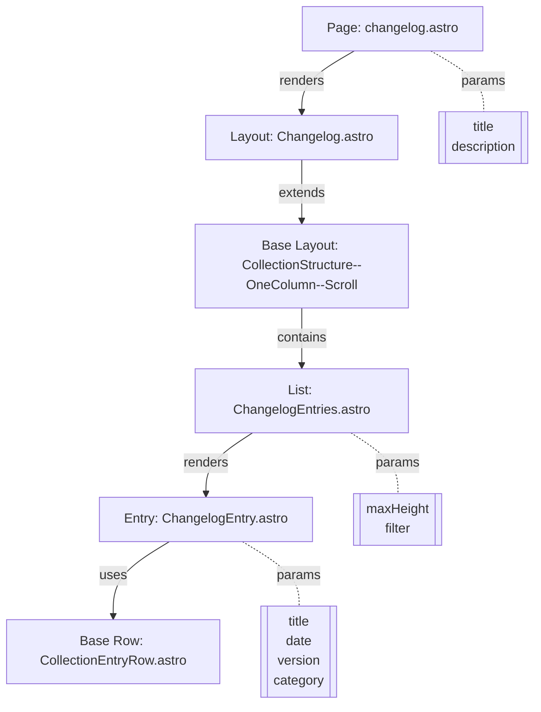

# Summary
Implemented a complete UI pipeline for rendering content collections, starting with the changelog as our first implementation. The system follows a strict component hierarchy with clear separation of structure and presentation, aggressive inline commenting, and consistent styling using our global CSS variables.

# Technical Details

## Component Architecture

### File Structure
```
site/src/
├── pages/workflow/
│   └── changelog.astro           (Entry point)
├── layouts/
│   ├── CollectionStructure--OneColumn--Scroll.astro (Base layout)
│   └── Changelog.astro          (Specialized layout)
├── components/
│   ├── basics/
│   │   ├── CollectionListScroll.astro (Generic list)
│   │   └── CollectionEntryRow.astro   (Generic row)
│   ├── workflow/
│   │   └── ChangelogEntries.astro     (Changelog list)
│   └── changelog/
│       └── ChangelogEntry.astro       (Single entry)
└── utils/
    └── frontmatterIrregularityFilterReturnsValidFrontmatterOnly.ts
```

### Component Flow


## Implementation Details

### 1. Base Components
Created reusable structural components that can be used across different collection types:

#### CollectionEntryRow.astro
- Basic row structure with consistent styling
- Hover effects using color-mix
- Support for highlighting
- Flexible content slot

#### CollectionListScroll.astro
- Smooth scrolling container
- Styled scrollbars for both Webkit and Firefox
- Fade effects at top and bottom
- Configurable max height

### 2. Specialized Components
Built changelog-specific components that extend the base structure:

#### ChangelogEntry.astro
- Metadata display (date, version, category)
- Consistent typography using CSS variables
- Content area with styled lists and code blocks

#### ChangelogEntries.astro
- Integration with Astro's content collections
- Built-in sorting by date
- Frontmatter validation filtering
- Container queries for responsive design

### 3. Layout System
Implemented a two-tier layout system:

#### CollectionStructure--OneColumn--Scroll.astro
- Base layout with sticky header
- Gradient title effect
- Responsive padding and spacing
- Content width constraints

#### Changelog.astro
- Extends base layout
- Adds timeline visual effect
- Dark mode optimizations
- Content width optimization

### 4. Utilities
Created supporting utilities:

#### formatDate.ts
- Consistent date formatting
- Localization support
- Type-safe interface

#### frontmatterIrregularityFilterReturnsValidFrontmatterOnly.ts
- Validates required fields
- Tag syntax validation
- Type guards for collection entries

## Style Integration

### Global Variables
Leveraged existing CSS variables for consistent theming:
- Colors from `--clr-lossless-*`
- Typography from `--ff-*` and `--fs-*`
- Spacing from `--gap` and `--flow-space`

### Visual Effects
Added several visual enhancements:
- Gradient effects for titles
- Timeline indicator for changelog
- Smooth hover transitions
- Fade effects for scroll containers

### Responsive Design
Implemented responsive features:
- Container queries for component-level breakpoints
- Mobile-friendly spacing and typography
- Optimized scrollbar behavior
- Dark mode considerations

# Memories Created

1. Component Architecture Pattern:
   - Standardized pipeline for content collections
   - Clear component hierarchy
   - Separation of concerns
   - Prop passing patterns

2. UI Implementation Details:
   - Complete file structure
   - Component relationships
   - Key features and styling
   - Integration points

# Next Steps

1. Testing:
   - Create example changelog entries
   - Test frontmatter validation
   - Verify responsive behavior
   - Check dark mode rendering

2. Documentation:
   - Add JSDoc comments to utilities
   - Create usage examples
   - Document component interfaces

3. Future Enhancements:
   - Add filtering UI
   - Implement search functionality
   - Consider pagination
   - Add animation effects

# References

1. Astro Documentation:
   - Content Collections
   - Component Architecture
   - Styling Best Practices

2. Design Inspiration:
   - Codeium Changelog UI
   - Modern Documentation Sites
   - Timeline-based Interfaces
