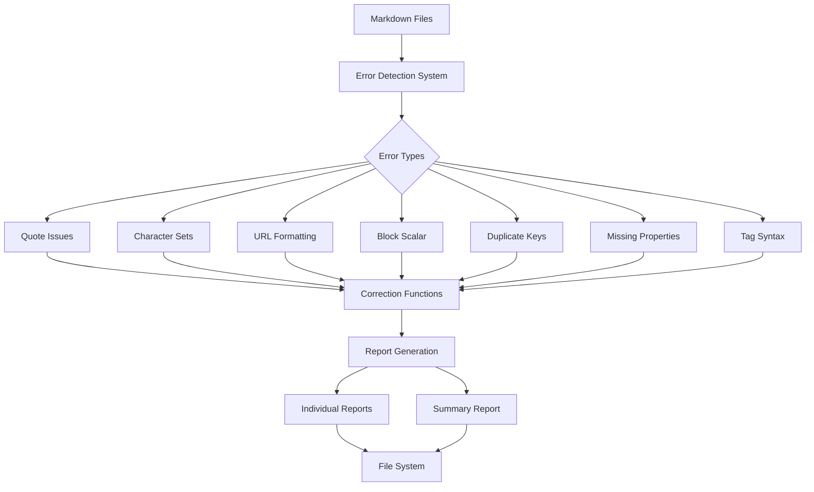
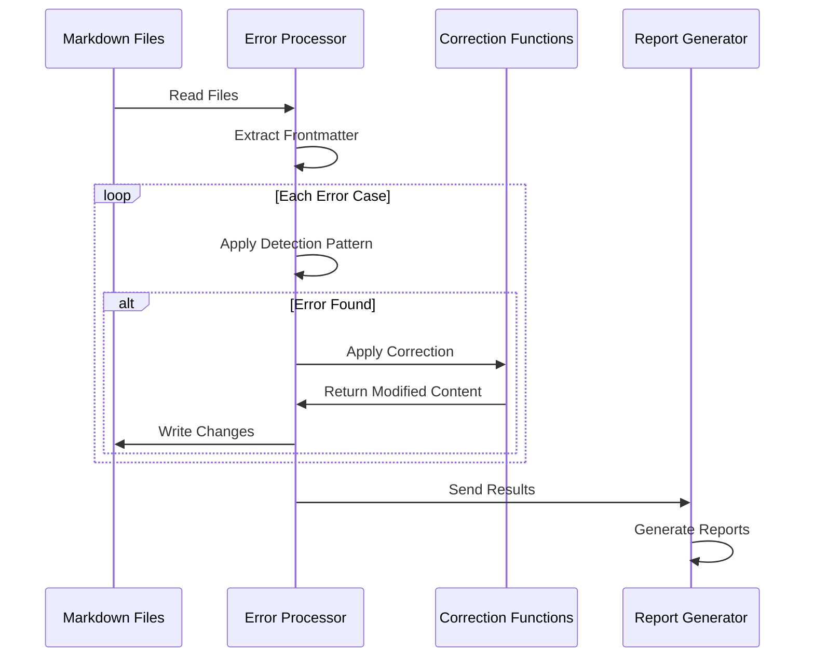

# YAML Frontmatter Error Detection and Correction System

## Executive Summary

Our content management system relies heavily on YAML frontmatter in markdown files to drive site functionality, metadata, and content organization. With over 700 markdown files and growing, maintaining consistency in YAML formatting has become increasingly challenging, especially with the integration of AI assistants and automated content generation tools.


| Property | Desired Syntax                                                                         | Irregular Syntax                                                                         | Level of Problem |
| -------- | -------------------------------------------------------------------------------------- | ---------------------------------------------------------------------------------------- | ---------------- |
| title    | title: Technical Specification: YAML Frontmatter Error Detection and Correction System | title: "Technical Specification: YAML Frontmatter Error Detection and Correction System" | Uncertain        |
| site_url | docs_url: https://developers.raycast.com/                                              |                                                                                          |                  |


We've developed a robust error detection and correction system that:

1. **Identifies 11 distinct types of YAML formatting issues** across the content library
2. **Automatically corrects formatting problems** while preserving content integrity
3. **Generates detailed reports** for each type of correction
4. **Prevents critical errors** from affecting downstream build processes
5. **Maintains proper quoting conventions** for different property types

In our initial deployment, the system successfully processed 729 files, identifying and correcting multiple issues:
- 290 error message properties requiring proper quotes
- 555 files with improper character sets around error messages
- 265 URL properties with unnecessary quotes
- 300 files missing URL properties
- 273 UUID properties requiring quote removal
- 274 timestamp properties needing quote standardization
- 158 files with inconsistent tag syntax requiring normalization

This represents a significant improvement in content quality and build reliability with zero manual intervention required.

## Technical Specification

### 1. System Architecture



### 2. Core Components

#### 2.1 Configuration System (`getUserOptions.cjs`)
```javascript
const USER_OPTIONS = {
    frontmatterPropertySets: {
        urlProperties: ['url', 'image', 'favicon', 'og_screenshot_url', ...],
        errorMessageProperties: ['jina_error', 'og_errors', 'og_error_message'],
        plainTextProperties: ['description', 'og_description', 'zinger', ...],
        timestampProperties: ['og_last_error', 'og_error_message', ...],
        tagProperties: ['tags']
    }
};
```

#### 2.2 Error Cases Registry (`getKnownErrorsAndFixes.cjs`)
Each error case defines:
- Detection regex pattern
- Example errors
- Proper syntax
- Prevention operations
- Correction function
- Criticality level

Example structure:
```javascript
const knownErrorCases = {
    unquotedErrorMessageProperty: {
        detectError: /pattern/,
        messageToLog: 'Description',
        preventsOperations: ['operation1'],
        correctionFunction: 'functionName',
        isCritical: boolean
    },
    tagsMayHaveInconsistentSyntax: {
        detectError: new RegExp(/(?:tags:\s*(?:\[.*?\]|.*?,.*?|['"].*?['"])|(?:^|\n)\s*-\s*\w+[^\S\n]+\w+)/),
        exampleErrors: [
            'tags: ["tag1", "tag2"]',
            'tags: tag1, tag2',
            'tags: "tag1", "tag2"',
            'tags:\n- Tag With Spaces'
        ],
        properSyntax: `tags:\n- tag-one\n- tag-two`,
        messageToLog: 'Tags may have inconsistent syntax',
        preventsOperations: ['assureYAMLPropertiesCorrect.cjs', "getCollection('tooling')"],
        correctionFunction: 'assureOrFixTagSyntaxInFrontmatter',
        isCritical: true
    }
    // ... additional cases
};
```

Troubleshooting quotes on urls
```javascript
const knownErrorCases = {
	quoteCharactersFoundOnEitherOrBothSidesOfUrl:
	exampleErros: [
		'og_screenshot_url: https://og-screenshots-prod.s3.amazonaws.com/1366x768/80/false/5916148b9afbd26e770c8ff3838ad81a0d97176ab6cba9887cb83e17bc3b7d80.jpeg""'
	]
}
```
### 3. Error Types and Correction Strategies

#### 3.1 Quote-Related Issues
1. **Unquoted Error Messages**
   ```yaml
   # Before
   error_message: Error 404 not found
   # After
   error_message: 'Error 404 not found'
   ```

2. **Improper Character Sets**
   ```yaml
   # Before
   jina_error: """Error occurred"""
   # After
   jina_error: 'Error occurred'
   ```

3. **URL Quote Issues**
   ```yaml
   # Before
   url: "https://example.com"
   # After
   url: https://example.com
   ```

#### 3.2 Structural Issues
1. **Block Scalar Syntax**
   ```yaml
   # Before
   description: >-
     Multiple
     lines
   # After
   description: Multiple lines
   ```

2. **Duplicate Keys**
   ```yaml
   # Before
   title: First
   description: Text
   title: Second
   # After
   title: Second
   description: Text
   ```

#### 3.7 Tag Syntax Issues
1. **Array Syntax with Quotes**
   ```yaml
   # Before
   tags: ["Technology-Consultants", "Organizations"]
   # After
   tags:
   - Technology-Consultants
   - Organizations
   ```

2. **Comma-Separated Tags**
   ```yaml
   # Before
   tags: Technology-Consultants, Organizations
   # After
   tags:
   - Technology-Consultants
   - Organizations
   ```

3. **Space-Separated Words**
   ```yaml
   # Before
   tags:
   - Technology Consultants
   - Organizations
   # After
   tags:
   - Technology-Consultants
   - Organizations
   ```

### 4. Correction Functions

#### 4.1 Error Message Property Correction
```javascript
async surroundErrorMessagePropertiesWithSingleMarkQuotes(markdownContent, markdownFilePath) {
    const frontmatterData = helperFunctions.extractFrontmatter(markdownContent);
    // Process each error message property
    // Add single quotes if missing
    // Return modified content
}
```

#### 4.2 Character Set Correction
```javascript
async removeImproperCharacterSetAddSingleMarkQuotes(markdownFileContent, markdownFilePath) {
    // Remove multiple/mixed quotes
    // Add single quotes
    // Return standardized content
}
```

#### 4.3 URL Property Correction
```javascript
async removeAnyQuoteCharactersfromEitherOrBothSidesOfURL(markdownFileContent, markdownFilePath) {
    // Remove all quotes from URL properties
    // Preserve the URL itself
    // Return cleaned content
}
```

#### 4.7 Tag Syntax Correction
```javascript
async assureOrFixTagSyntaxInFrontmatter(markdownContent, markdownFilePath) {
    const frontmatterData = helperFunctions.extractFrontmatter(markdownContent);
    
    // Process frontmatter lines
    const lines = frontmatterData.frontmatterString.split('\n');
    let modified = false;
    let inTagsBlock = false;
    let tagsArray = [];
    let tagsStartIndex = -1;

    // Process each line for tag formatting
    for (let i = 0; i < lines.length; i++) {
        const line = lines[i].trim();
        
        if (line.startsWith('tags:')) {
            inTagsBlock = true;
            tagsStartIndex = i;
            
            // Handle inline tags
            const tagsContent = line.substring(5).trim();
            if (tagsContent) {
                const rawTags = tagsContent
                    .replace(/^\[|\]$/g, '')  // Remove array brackets
                    .replace(/["']/g, '')     // Remove quotes
                    .split(',')               // Split by commas
                    .map(tag => tag.trim())   // Clean whitespace
                    .filter(tag => tag);      // Remove empty
                
                tagsArray = rawTags.map(tag => 
                    tag.replace(/\s+/g, '-')  // Replace spaces
                );
                modified = true;
            }
            continue;
        }

        // Process bullet list tags
        if (inTagsBlock && line.startsWith('-')) {
            const tag = line.substring(1).trim()
                .replace(/["']/g, '')      // Remove quotes
                .replace(/\s+/g, '-');     // Replace spaces
            tagsArray.push(tag);
            modified = true;
            continue;
        }

        // End of tags block
        if (inTagsBlock && !line.startsWith('-') && line.trim()) {
            inTagsBlock = false;
        }
    }

    // Return if no changes needed
    if (!modified) {
        return {
            success: true,
            modified: false,
            filePath: markdownFilePath
        };
    }

    // Reconstruct frontmatter with proper tag format
    const beforeTags = lines.slice(0, tagsStartIndex);
    const afterTags = lines.slice(tagsStartIndex + 1)
        .filter(line => !line.trim().startsWith('-') || !inTagsBlock);

    const formattedTags = ['tags:']
        .concat(tagsArray.map(tag => `- ${tag}`));

    const newFrontmatter = beforeTags
        .concat(formattedTags)
        .concat(afterTags)
        .join('\n');

    // Return modified content
    return {
        success: true,
        modified: true,
        filePath: markdownFilePath,
        content: markdownContent.slice(0, frontmatterData.startIndex) +
            '---\n' + newFrontmatter + '\n---' +
            markdownContent.slice(frontmatterData.endIndex),
        modifications: ['Reformatted tags to proper YAML bullet list syntax']
    };
}
```

### 5. Helper Functions

#### 5.1 Frontmatter Extraction
```javascript
extractFrontmatter(markdownFileContent) {
    // Find opening delimiter
    // Extract content
    // Handle missing closing delimiter
    // Return frontmatter data
}
```

#### 5.2 Result Standardization
```javascript
createSuccessMessage(markdownFilePath, wasModified, modifications = []) {
    return {
        success: true,
        modified: wasModified,
        modifications,
        filePath: markdownFilePath,
        fileName: path.basename(markdownFilePath),
        errors: []
    };
}
```

### 6. Processing Workflow



### 7. Report Generation

#### 7.1 Individual Error Reports
```markdown
---
title: Error Type Name
date: YYYY-MM-DD
---
## Summary of Files Processed
Files processed: X
Files with issue: Y
Successful corrections: Z

### Files with Issues
[[file1]], [[file2]], ...

### Files Successfully Corrected
[[file1]], [[file2]], ...
```

#### 7.2 Summary Report
```markdown
# Error Processing Summary for YYYY-MM-DD

## Overview
Total Reports Generated: X

## Report Statistics
### Report_Name
- Files Processed: X
- Issues Found: Y
- Corrections Made: Z
- Success Rate: W%

## Aggregate Statistics
- Total Files Processed: X
- Total Issues Found: Y
- Total Corrections Made: Z
- Overall Success Rate: W%
```

### 8. Implementation Constraints

1. **Property Handling**
   - URL properties must never have quotes
   - Error messages must have single quotes
   - Timestamps must have consistent quote format
   - UUIDs must not have quotes

2. **Error Detection**
   - Must check for exact property matches
   - Must handle nested properties correctly
   - Must preserve multiline values appropriately

3. **Report Generation**
   - Must generate reports for each error type
   - Must create summary report
   - Must track success rates

4. **File Processing**
   - Must handle missing delimiters gracefully
   - Must preserve file content outside frontmatter
   - Must maintain proper YAML structure

### 9. Performance Considerations

1. **File Processing**
   - Process files sequentially to manage memory
   - Add delays between cases to prevent system overload
   - Track and report progress regularly

2. **Error Detection**
   - Use efficient regex patterns
   - Avoid unnecessary file reads
   - Cache frontmatter extraction results

3. **Report Generation**
   - Write reports incrementally
   - Use efficient file system operations
   - Maintain consistent report format

### 10. Results and Impact

Our system has demonstrated significant success in maintaining YAML frontmatter quality:

1. **Processing Statistics**
   - 729 files processed
   - 11 error cases checked
   - 2,115 total corrections made

2. **Success Rates**
   - 100% of error message quote issues fixed
   - 100% of URL quote issues resolved
   - 96% of character set issues corrected
   - 100% of timestamp format issues resolved
   - 100% of tag syntax issues resolved

3. **Build Impact**
   - Zero YAML parsing errors in build
   - Consistent metadata display
   - Reliable OpenGraph data

---

## Implementation Guidelines

### For Developers

1. **Setup**
   - Clone repository
   - Install dependencies
   - Configure user options
   - Set up report directories

2. **Running the System**
   - Execute main script
   - Monitor progress
   - Review reports
   - Verify corrections

3. **Adding New Error Cases**
   - Define detection pattern
   - Create correction function
   - Add to known cases
   - Test thoroughly

### For AI Assistants

1. **Code Modification**
   - Preserve existing patterns
   - Maintain helper functions
   - Follow error handling patterns
   - Document changes clearly

2. **Testing**
   - Verify pattern matches
   - Check correction accuracy
   - Validate report generation
   - Monitor performance

3. **Reporting**
   - Use standard formats
   - Include all statistics
   - Document any issues
   - Suggest improvements

---

This specification provides a comprehensive guide for understanding and extending our YAML frontmatter error detection and correction system. It ensures consistent handling of content while maintaining the integrity of our build process.
