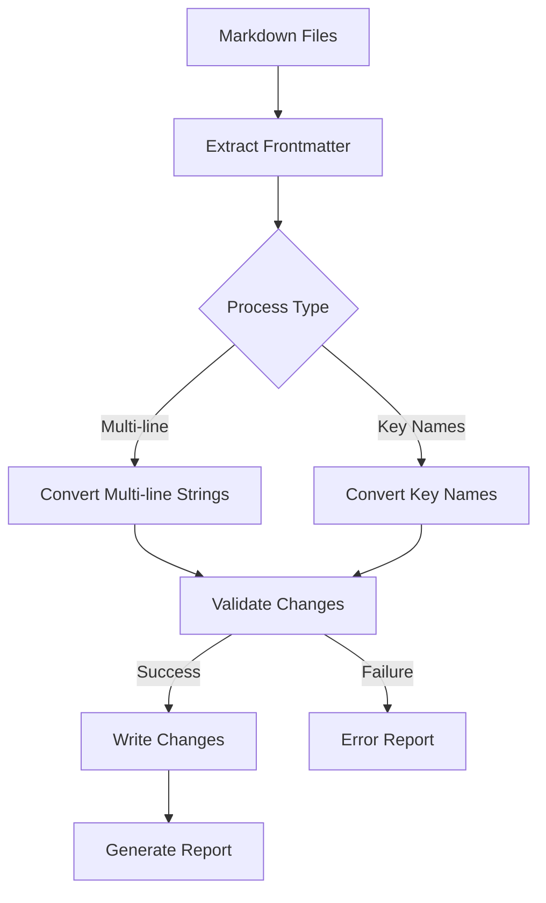

## Executive Summary

The YAML cleanup scripts (`convertMultiLineStringsToSingleLineStrings.cjs` and `convertKeyNamesInYAML.cjs`) are essential components of our content management pipeline. They address specific YAML frontmatter issues that could impact site generation, content organization, and maintainability.

### Business Impact
- Reduces technical debt by standardizing YAML property formats
- Prevents potential parsing errors in production
- Enables consistent content querying and filtering
- Automates tedious manual formatting tasks
- Provides clear audit trails of content modifications

### Key Features
- Converts multi-line string properties to single-line format for better readability
- Standardizes key names based on predefined mappings
- Generates detailed reports of all modifications
- Non-destructive operation with proper error handling
- Processes files recursively across content directories

## Technical Specification

### Architecture Overview



### Core Components

#### 1. Dependencies and Imports
```javascript
const fs = require('fs');
const path = require('path');
const helperFunctions = require('../../build-scripts/getKnownErrorsAndFixes.cjs').helperFunctions;
const knownErrorCases = require('../../build-scripts/getKnownErrorsAndFixes.cjs').knownErrorCases;
```

#### 2. Configuration
Both scripts use a consistent configuration structure:
```javascript
const TARGET_FILES = { targetDir: "site/src/content/" };
const REPORTS_DIR = "site/scripts/data-or-content-generation/fixes-needed/errors-processing/";
```

For key name conversion, additional configuration:
```javascript
const keyReplacementPairs = {
    case01: {
        undesiredSyntax: "github-url",
        desiredSyntax: "github_repo_url",
        reportName: "Convert-GitHub-URL-Keys"
    },
    // Additional cases...
};
```

### Processing Logic

#### 1. Multi-line String Detection
| Step | Implementation | Purpose |
|------|---------------|---------|
| Property Match | `/^([^:\n]+):\s*(.*)$/` | Identifies property lines |
| Continuation Check | `/^\s/` or no colon | Detects multi-line content |
| Boundary Check | `/^[^-\s].*?:/` | Identifies new properties |
| List Item Check | Starts with `-` | Preserves list structures |

#### 2. Key Name Conversion
- Exact string matching for key names
- Case-sensitive replacement
- Maintains property values
- Preserves surrounding whitespace

### Implementation Details

#### Function Return Structure
```javascript
{
    success: boolean,
    modified: boolean,
    filePath: string,
    hadIssue: boolean,
    content?: string
}
```

#### Error Handling Strategy
1. Non-blocking operation
2. File-level error isolation
3. Detailed error reporting
4. Modification tracking

### Integration Points

#### Input Sources
- Individual Markdown files
- Directory trees
- Specific content sections

#### Output Destinations
- Modified Markdown files
- Error reports with [[fileName]] format
- Daily dated reports
- Sequential report numbering

### Best Practices for Extension

#### 1. Adding New Key Replacements
```javascript
keyReplacementPairs[caseXX] = {
    undesiredSyntax: "old-key",
    desiredSyntax: "new_key",
    reportName: "Descriptive-Name"
};
```

#### 2. Modifying Multi-line Detection
- Update regex patterns in single location
- Test with various indentation patterns
- Verify list item preservation
- Handle edge cases

### Performance Considerations

#### 1. File Processing
- Single-pass frontmatter extraction
- Efficient string manipulation
- Minimal regex operations
- Batched file writes

#### 2. Memory Management
- Stream-based file operations
- Efficient string concatenation
- Proper cleanup after processing

### Testing Requirements

#### 1. Unit Tests
- Property detection accuracy
- Multi-line string handling
- Key name replacement logic
- Edge case coverage

#### 2. Integration Tests
- Directory traversal
- Report generation
- Error handling
- File system operations

### Security Considerations

#### 1. File Operations
- Path sanitization
- Access control
- Atomic writes
- Error recovery

#### 2. Input Validation
- YAML structure verification
- Key name validation
- Content length checks
- Character encoding

### Monitoring and Maintenance

#### 1. Key Metrics
- Files processed
- Successful conversions
- Error rates
- Processing duration

#### 2. Logging Requirements
- Operation summaries
- Error details
- File modifications
- Performance stats

### Documentation Requirements

#### 1. Code Documentation
- Function purposes
- Parameter descriptions
- Return values
- Usage examples

#### 2. User Documentation
- Configuration options
- Key replacement setup
- Error resolution
- Report interpretation

### Known Limitations

1. Multi-line String Processing
   - Cannot process nested structures
   - May affect intentional line breaks
   - Requires careful list handling

2. Key Name Conversion
   - Case-sensitive matching only
   - No partial key matching
   - Single-level key replacement

### Future Enhancements

1. Potential Improvements
   - Regex-based key matching
   - Nested key support
   - Custom report formats
   - Backup functionality

2. Integration Opportunities
   - CI/CD pipeline integration
   - Content validation hooks
   - Automated testing
   - Performance monitoring