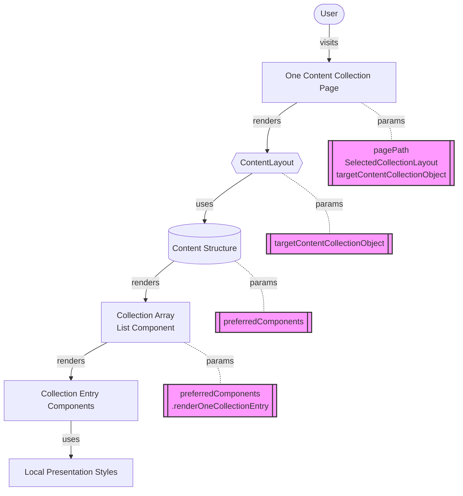

# Goal  
## High-level objective
Develop a maintainable full Component Pipeline for Content Collections in structure and skeleton HTML and CSS. What do I mean by that? Well, we separate the structural styles from the presentational styles that are applied upon render of a specific Content Collection.  

## Inspiration and Real-world examples
The Codeium changelog (https://codeium.com/changelog) demonstrates effective content collection rendering with:
- Clean, hierarchical structure
- Consistent entry formatting
- Flexible content presentation
- Clear visual hierarchy

# Component Pipeline  # Visual representation


# Rendering Cascade  # Implementation flow

## 1. Page Level  # Entry point
- **Purpose**: Initialize content collection rendering
- **Input**: URL parameters and collection configuration
- **Output**: Configured layout component
- **Example**: `/changelog` or `/blog` pages

### User Created page:
`site/src/pages/workflow/changelog.astro`

Eventually renders target collection:
`site/src/content/changelog--content` 

## 2. Layout Level  # Visual structure
- **Purpose**: Define overall page structure
- **Input**: Collection object and layout preferences
- **Output**: Structured content container
- **Example**: Grid, list, or card layouts

### User Created layout:
`site/src/layouts/CollectionStructure--OneColumn--Scroll.astro`
`site/src/layouts/Changelog.astro` // only if we need something more specific that doesn't happen in components

## 3. Content Structure  # Data organization
- **Purpose**: Organize and prepare collection data
- **Input**: Content Collection Object and Raw collection
- **Output**: Processed data for rendering
- **Example**: Sorting, filtering, grouping

### User Created content structure:
`site/src/content/changelog--content` 

#### Run this utility function to ONLY FILTER out files with invalid frontmatter, include files with valid frontmatter:
`site/src/utils/frontmatterIrregularityFilterReturnsValidFrontmatterOnly.ts`

## 4. Collection Array  # Entry management

User created component:
`site/src/components/basics/CollectionListScroll.astro` // abstract structure for single column list scroll.
`site/src/components/workflow/ChangelogEntries.astro` // specific to Changelog array. 
- **Purpose**: Handle multiple collection entries
- **Input**: Processed collection data
- **Output**: Mapped entry components
- **Action**: Sort by Date, most recent on top. 
- **Example**: List or grid container


## 5. Entry Components  # Individual items

User created empty component:

`site/src/components/basics/CollectionEntryRow.astro` // abstract structure for single row of content.
`site/src/components/changelog/ChangelogEntry.astro` // specific to rendering each changelog entry. 

- **Purpose**: Render single collection items
- **Input**: Individual entry data
- **Output**: Styled content component
- **Example**: Blog post card or changelog entry


## 6. Presentation Layer  # Visual styling
- **Purpose**: Apply collection-specific styles
- **Input**: Base component structure
- **Output**: Final styled UI
- **Example**: Colors, typography, spacing

`site/src/components/changelog/ChangelogEntry.astro`

# Implementation Guidelines  # Best practices

Write your reasoning and problem solving down in your Session Log!  

## 1. Separation of Concerns  # Modularity
- Structure separate from presentation
- Reusable base components
- Collection-specific style overrides

## 2. Component Hierarchy  # Organization
- Clear parent-child relationships
- Defined component interfaces
- Consistent prop patterns

## 3. Style Management  # CSS architecture
- Base structural styles
- Theme-based presentation
- Scoped CSS modules

## 4. Data Flow  # State management
- Unidirectional data flow
- Clear prop definitions
- Typed interfaces

## 5. Performance  # Optimization
- Lazy loading strategies
- Component memoization
- Style optimization

# Example Implementation  # Code structure
```typescript
// 1. Page Level
export const ChangelogPage = ({ pagePath, layout, collection }) => {
  return <ChangelogLayout collection={collection} />;
};

// 2. Layout Level
const ChangelogLayout = ({ collection }) => {
  return <ContentStructure data={collection} />;
};

// 3. Content Structure
const ContentStructure = ({ data }) => {
  return <CollectionList entries={data.entries} />;
};

// 4. Collection Array
const CollectionList = ({ entries }) => {
  return entries.map(entry => <EntryComponent {...entry} />);
};

// 5. Entry Component
const EntryComponent = ({ title, date, content }) => {
  return (
    <article class="entry">
      <h2>{title}</h2>
      <time>{date}</time>
      <div>{content}</div>
    </article>
  );
};
``` 