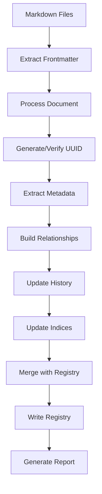

## Executive Summary

The Content Registry system (`trackMarkdownFilesInRegistry.cjs`) is a critical component of our content management infrastructure. It maintains a centralized, UUID-based registry of all markdown files, tracking their metadata, relationships, and complete history of changes.

### Business Impact
- Enables efficient content discovery and relationships
- Provides robust version tracking and change history
- Supports future database migration with UUID-first design
- Maintains data integrity with non-destructive operations
- Creates foundation for advanced content features

### Key Features
- UUID-based document identification
- Comprehensive history tracking with ISO timestamps
- Multiple indexing strategies for efficient lookups
- Relationship tracking between documents
- Detailed error reporting and validation

## Technical Specification

### Architecture Overview



### Core Components

#### 1. Registry Data Model
```json
{
  "documents": {
    "[uuid]": {
      "referredToAs": {
        "primaryFileName": "string",
        "aliases": []
      },
      "urls": {
        "siteUrl": "string",
        "youtubeChannelUrl": "string",
        // ... other URLs
      },
      "primaryFiles": {
        "canonical": {
          "path": "string"
        },
        "document_variants": []
      },
      "connectedDocuments": {
        "connected_documents": [
          {
            "type": "string",
            "reference": "string"
          }
        ]
      },
      "history": [
        {
          "timestamp": "ISO-8601",
          "type": "event_category",
          "action": "specific_action",
          "details": {}
        }
      ],
      "metadata": {
        "siteVisibility": "string",
        "semanticVersion": {
          "version": "number",
          "created_at": "ISO-8601",
          "last_modified": "ISO-8601",
          "status": "string"
        }
      }
    }
  },
  "indices": {
    "by_filename": {
      "[filename]": {
        "uuid": "string",
        "context": "string",
        "is_canonical": "boolean"
      }
    },
    "by_path": {
      "[path]": "uuid"
    },
    "by_uuid": {
      "[uuid]": {
        "memory": "number",
        "timestamp": "ISO-8601"
      }
    }
  }
}
```

#### 2. Core Functions

1. **Document Processing**
   - UUID generation/verification
   - Frontmatter extraction
   - Property mapping and normalization
   - History entry creation
   - Relationship building

2. **Registry Management**
   - Non-destructive updates
   - Index maintenance
   - Version tracking
   - Change detection

3. **Error Handling**
   - Validation checks
   - Error reporting
   - Recovery mechanisms

### Implementation Details

#### 1. Property Mapping
- Snake case to camel case conversion
- URL property standardization
- Special handling for parent organizations
- Timestamp normalization

#### 2. History Tracking
```json
{
  "history": [
    {
      "timestamp": "2025-03-17T06:02:15.000Z",
      "type": "content_creation",
      "action": "initial_creation",
      "details": {
        "source": "markdown_file",
        "path": "/path/to/file.md"
      }
    },
    {
      "timestamp": "2025-03-17T06:02:15.000Z",
      "type": "reference_update",
      "action": "parent_org_linked",
      "details": {
        "type": "parentOrganization",
        "value": "Organization Name",
        "source": "frontmatter"
      }
    }
  ]
}
```

##### Event Types and Actions
1. Content Events
   - `content_creation`: Initial document creation
   - `content_update`: Modifications to content
   - Example: Adding URLs, changing text

2. Metadata Events
   - `metadata_update`: Changes to document metadata
   - Actions: `version_increment`, `status_change`
   - Example: Updating visibility settings

3. Reference Events
   - `reference_update`: Changes to document relationships
   - Actions: `parent_org_linked`, `parent_org_changed`
   - Example: Linking parent organizations

4. Path Events
   - `path_change`: File location changes
   - Example: Document moves or renames

5. AI Interaction Events
   - `ai_interaction`: AI service operations
   - Example: OpenGraph fetches

##### History Best Practices
1. Timestamps
   - Always use ISO 8601 format
   - Include timezone information
   - Example: `2025-03-17T06:02:15.000Z`

2. Event Structure
   - Chronological order
   - Append-only updates
   - Detailed context in details object

3. Change Tracking
   - Record both old and new values
   - Include change source
   - Track user operations

4. Version Control
   - Increment on meaningful changes
   - Track change rationale
   - Maintain status history

#### 3. File Name Handling
```javascript
// Primary File Name Extraction
const primaryFileName = path.basename(filePath, '.md');
// Example: 'site/src/content/tooling/AI-Toolkit/Limitless AI.md' -> 'Limitless AI'

// Context Path Generation
const context = path.dirname(filePath).split('/').slice(-2).join('/');
// Example: 'site/src/content/tooling/AI-Toolkit/Limitless AI.md' -> 'AI-Toolkit'

// Index Entry Creation
const indexEntry = {
  uuid: documentUuid,
  context: context,
  is_canonical: true
};
```

### Document Relationships and Indexing

#### 1. Document Relationships
```json
{
  "connectedDocuments": {
    "connected_documents": [
      {
        "type": "parentOrganization",
        "reference": "Organization Name"
      },
      {
        "type": "canonical",
        "reference": "Primary Document UUID"
      }
    ]
  }
}
```

##### Relationship Types
1. Parent Organizations
   - Links to organizational entities
   - Maintains clean hierarchy
   - Example: Company -> Product

2. Canonical References
   - Points to primary document
   - Handles content variants
   - Example: Original -> Translation

3. Content Hierarchies
   - Supports nested structures
   - Maintains parent-child links
   - Example: Course -> Lesson

4. Alternative Versions
   - Tracks document variants
   - Links related content
   - Example: Draft -> Published

#### 2. Index Structure
```json
{
  "indices": {
    "by_filename": {
      "Document Name": {
        "uuid": "32e4500c-1d6b-40ac-8524-b566904e5dc5",
        "context": "tooling/Productivity",
        "is_canonical": true
      }
    },
    "by_path": {
      "/absolute/path/to/file.md": "32e4500c-1d6b-40ac-8524-b566904e5dc5"
    },
    "by_uuid": {
      "32e4500c-1d6b-40ac-8524-b566904e5dc5": {
        "memory": 4.0355987548828125,
        "timestamp": "2025-03-17T06:02:15.000Z"
      }
    }
  }
}
```

##### Index Benefits
1. Multiple Access Patterns
   - Fast filename lookups
   - Efficient path resolution
   - Direct UUID access

2. Context Awareness
   - Directory-based context
   - Disambiguation support
   - Hierarchical organization

3. Performance Optimization
   - O(1) lookups by UUID
   - Quick path resolution
   - Efficient caching

4. Data Integrity
   - Minimal duplication
   - Easy validation
   - Clean separation

##### Index Management
1. Filename Index
   - Stores document context
   - Tracks canonical status
   - Supports disambiguation

2. Path Index
   - Maps absolute paths
   - Quick file location
   - Efficient updates

3. UUID Index
   - Primary lookup table
   - Performance metrics
   - Timestamp tracking

### Integration Points

#### 1. Build Process
- Part of the master build orchestration
- Pre-build validation
- Post-build reporting

#### 2. Content Management
- Markdown file processing
- Frontmatter standardization
- Relationship mapping
- Version tracking

### Error Handling and Reporting

#### 1. Validation Checks
- UUID presence and format
- Required property validation
- URL format verification
- Relationship integrity

#### 2. Error Reports
- Detailed error messages
- File location information
- Suggested fixes
- Impact assessment

### Performance Considerations

#### 1. UUID-First Design Benefits
- O(1) document lookups
- Efficient relationship tracking
- Natural sharding capability
- Clean content/index separation
- Duplicate handling support

#### 2. Resource Management
- Memory-efficient operations
- Controlled file I/O
- Proper cleanup procedures

### Documentation Requirements

#### 1. Code Documentation
- Function documentation
- Type definitions
- Usage examples
- Error handling guidelines

#### 2. User Documentation
- Configuration options
- Usage instructions
- Troubleshooting guide
- Best practices

### Testing Requirements

#### 1. Test Cases
- UUID generation/verification
- Property mapping
- History tracking
- Index management
- Error handling

#### 2. Validation
- Data integrity checks
- Format validation
- Relationship verification
- Index consistency

### Security Considerations

#### 1. Data Protection
- Safe file operations
- Error message sanitization
- Input validation
- Access control

#### 2. Error Prevention
- Type checking
- Path validation
- Format verification
- Relationship integrity

### Maintenance and Support

#### 1. Monitoring
- Error tracking
- Performance metrics
- Usage statistics
- Health checks

#### 2. Updates
- Version compatibility
- Data migration
- Schema evolution
- Feature additions
