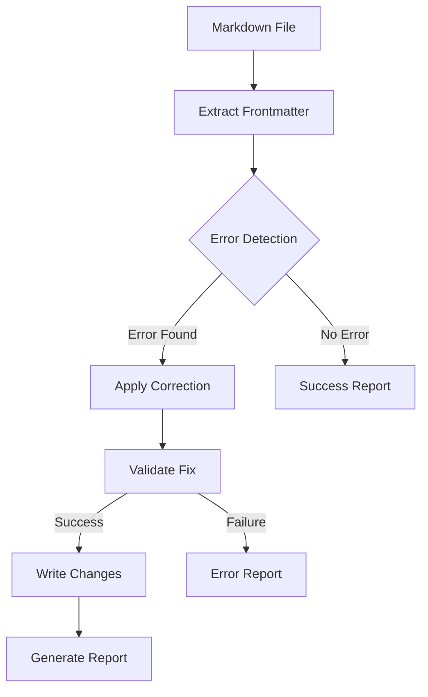

## Executive Summary

The `getKnownErrorsAndFixes.cjs` script is a critical component of our Markdown content processing pipeline. It identifies and corrects common YAML frontmatter errors that could prevent proper site generation or cause runtime issues. This script ensures content reliability without requiring manual intervention.

### Business Impact
- Reduces content publishing delays by automatically fixing common formatting errors
- Prevents site build failures due to malformed YAML
- Maintains consistent content structure across the platform
- Enables scalable content management by automating error detection and correction

### Key Features
- Automated detection of 10+ common YAML frontmatter errors
- Self-healing capabilities for critical formatting issues
- Detailed reporting of modifications for tracking and auditing
- Non-blocking operation for non-critical issues

## Technical Specification

### Architecture Overview



### Core Components

#### 1. Error Detection System
The script uses a registry of known error patterns (`knownErrorCases`) that defines:
- Error detection regex patterns
- Example error cases
- Proper syntax examples
- Criticality level
- Affected operations

Example error case structure:
```javascript
unquotedErrorMessageProperty: {
    detectError: /^(error_message|og_errors):[ \t]*[^"'][^"\n]+$/m,
    messageToLog: 'Contains unquoted error message property',
    isCritical: true
}
```


‘’’javascript


tags: ["Code-Generators", "IDE-Plugins", "AI-Toolkit", "Generative-AI"]

‘’
#### 2. Correction Functions
Each error type has a corresponding correction function that:
- Isolates the frontmatter
- Applies specific fixes
- Maintains file integrity
- Returns standardized result objects

#### 3. Helper Functions
Common operations are abstracted into helper functions:
- `extractFrontmatter`: Safely extracts YAML frontmatter
- `createSuccessMessage`: Standardizes success reporting
- `createErrorMessage`: Standardizes error reporting
- `processMarkdownFiles`: Handles batch processing

### Error Types and Corrections

| Error Type | Detection Method | Correction Strategy |
|------------|-----------------|-------------------|
| Unquoted Error Messages | Regex Pattern | Add single quotes |
| Improper Character Sets | Regex Pattern | Clean and standardize |
| URL Quote Issues | Regex Pattern | Remove surrounding quotes |
| Block Scalar Syntax | Regex Pattern | Convert to inline string |
| Unbalanced Quotes | Regex Pattern | Balance quote marks |
| Duplicate Keys | Regex Pattern | Remove duplicates |
| Unnecessary Spacing | Regex Pattern | Normalize spacing |
| Broken URLs | Regex Pattern | Reconstruct URL |
| Missing URL Properties | Regex Pattern | Flag for review |
| UUID Quote Issues | Regex Pattern | Remove quotes |

### Implementation Details

#### Function Return Structure
All correction functions return a standardized object:
```javascript
{
    success: boolean,
    modified: boolean,
    modifications: Array<Modification>,
    filePath: string,
    fileName: string,
    errors: Array<string>,
    content?: string
}
```

#### Error Handling Strategy
1. Non-blocking operation for non-critical errors
2. Detailed error reporting for debugging
3. Modification tracking for audit purposes
4. Fallback mechanisms for complex cases

### Integration Points

1. **Input Sources**
   - Individual Markdown files
   - Directory of Markdown files
   - File arrays from other scripts

2. **Output Destinations**
   - Modified Markdown files
   - Error reports
   - Modification logs
   - Integration with reporting system

### Best Practices for Extension

1. **Adding New Error Types**
   - Add pattern to `knownErrorCases`
   - Create corresponding correction function
   - Update error type documentation
   - Add test cases

2. **Modifying Existing Patterns**
   - Update regex in single source of truth only to `knownErrorCases.${caseName}.detectError`
   - Maintain backwards compatibility
   - Document pattern changes
   - Update affected test cases

### Performance Considerations

1. **Optimization Techniques**
   - Single-pass frontmatter extraction
   - Efficient regex patterns
   - Minimal file operations
   - Batched processing capability

2. **Resource Management**
   - Asynchronous file operations
   - Memory-efficient string manipulation
   - Proper error boundary handling

### Testing Requirements

1. **Unit Tests**
   - Individual correction functions
   - Helper function validation
   - Error case coverage
   - Edge case handling

2. **Integration Tests**
   - Multi-file processing
   - Error aggregation
   - Reporting system integration
   - Performance benchmarks

### Security Considerations

1. **File Operations**
   - Sanitized file paths
   - Controlled file access
   - Backup mechanisms
   - Atomic write operations

2. **Input Validation**
   - Frontmatter boundary checking
   - Content length limits
   - Character encoding validation
   - Path traversal prevention

### Monitoring and Maintenance

1. **Key Metrics**
   - Error detection rates
   - Correction success rates
   - Processing time
   - File modification tracking

2. **Logging Requirements**
   - Error occurrences
   - Modification details
   - Performance metrics
   - System health indicators

### Documentation Requirements

1. **Code Documentation**
   - JSDoc comments
   - Function signatures
   - Type definitions
   - Usage examples

2. **Operational Documentation**
   - Setup instructions
   - Configuration options
   - Troubleshooting guides
   - Maintenance procedures


